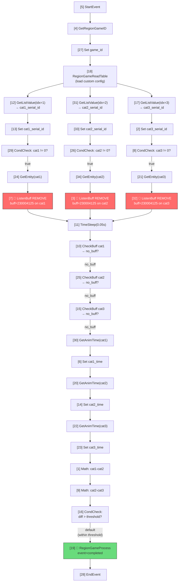

# Game Type 10 — FREEZE (点穴定身 / Dianxue Freeze) Analysis

## Question / Scope

What is region game type 10? How does it work? Can we automate solving it?

---

## Evidence

### 1. Type Identification

**Source:** [region_game_consts.lua:L22](file:///c:/temp/Where%20Winds%20Meet/Scripts/source_decompiled/hexm/common/consts/region_game_consts.lua#L22)

```lua
_M.REGION_GAME_MMM_FREEZE = 10
```

**Evidence Confidence: 5/5** — Direct definition.

The freeze minigame is an MMM (Miêu Miêu Meo) exploration activity where the player must use the dianxue (acupuncture) skill to freeze NPC entities into matching poses simultaneously.

---

### 2. Client-Side Handler

**Source:** [region_game_server.lua:L916-L922](file:///c:/temp/Where%20Winds%20Meet/Scripts/source_decompiled/hexm/client/entities/local/player_avatar_members/gameplays/region_game/region_game_server.lua#L916-L922)

```lua
local RegionGameMMMFreeze = class("RegionGameMMMFreeze", RegionGameServer)
_M.RegionGameMMMFreeze = RegionGameMMMFreeze

function RegionGameMMMFreeze:on_game_completed()
  RegionGameMMMFreeze.on_game_completed.on_game_completed(self)
  self:clear_storyline()
end
```

The client handler is **minimal** — just a stub that clears the storyline on completion. All gameplay logic is in the **client storyline** (`cat_dianxue.etsb`).

**Evidence Confidence: 5/5** — Direct source.

> [!IMPORTANT]
> Do NOT confuse with `RegionGameMMMDianXue` (type 43, line 844), which is a different game type that uses `t_cat_serial_id` for skeleton-ready tracking. Type 10 (`FREEZE`) and type 43 (`DIANXUE`) are distinct game types sharing the dianxue theme.

---

### 3. Type Config (Probe-Verified ✅)

**Source:** Runtime probe of `G.datam.region_game_type_config:get(10)`

| Key | Value | Purpose |
|-----|-------|---------|
| `type_no` | `10` | Type identifier |
| `client_handler` | `region_game_server.RegionGameMMMFreeze` | Client handler class path |
| `gameplay_storyline` | `client/wanfa/miaomiaomiao/cat_dianxue` | Client storyline `.etsb` path |
| `wanfa_serial_record` | `[t_cat_serial_id, t_cat_c_serial_id]` | Config keys holding entity serial IDs |
| `reset_on_trasfer` | `1` | Reset game on map transfer |
| `gameplay_name` | `-3866123716708192097` | Internal identifier |

No `common_storyline` exists — the client storyline is the sole validator.

**Evidence Confidence: 5/5** — Direct probe result.

---

### 4. Custom Config (Probe-Verified ✅)

**Source:** Runtime probe of `G.main_player:get_region_game_custom_config(610011)`

| Key | Type | Example Value | Purpose |
|-----|------|---------------|---------|
| `id` | number | `610011` | Game instance ID |
| `t_cat_serial_id` | list[3] | `[1630200392, 1630200393, 1630200394]` | NPC entity serial IDs (targets to freeze) |
| `t_cat_c_serial_id` | list[3] | `[1630200373, 1630200374, 1630200375]` | Companion/reference entity serial IDs |
| `t_status_id` | number | `49002102` | Interact status ID |
| `t_delay1` | number | `0.0` | Delay before cat 1 animation |
| `t_delay2` | number | `1.0` | Delay before cat 2 animation |
| `t_delay3` | number | `1.5` | Delay before cat 3 animation |
| `t_time_diff_fix` | number | `0.3` | Time difference threshold for simultaneous freeze |

**Evidence Confidence: 5/5** — Direct probe.

---

### 5. NPC Entity Properties (Probe-Verified ✅)

**Source:** Runtime probe of NPC entities from `t_cat_serial_id`

| Property | Cat 1 (sid=1630200392) | Cat 2 (sid=1630200393) | Cat 3 (sid=1630200394) |
|----------|------------------------|------------------------|------------------------|
| `No` | 6300061 | 6300062 | 6300063 |
| `fake_server` | `true` | `true` | `true` |
| `check_can_be_dianxue()` | `true` | `true` | `true` |
| `xuewei_config_id` | `26` | `26` | `26` |
| `xuewei_list` | `[32]` | `[32]` | `[32]` |
| interact comp | none | none | none |

All 3 NPCs support dianxue, share `xuewei_config_id=26` (acupoint config), and have no interact component (dianxue is skill-based, not interaction-based).

**Evidence Confidence: 5/5** — Direct probe.

---

### 6. Storyline Analysis (Probe-Verified ✅)

**File:** `Storyline/client/wanfa/miaomiaomiao/cat_dianxue.etsb`
**Size:** 13,517 bytes | **Nodes:** 34 | **Variables:** 14

#### Variables

| Name | Type | Default | Purpose |
|------|------|---------|---------|
| `game_id` | Int | 0 | Runtime game ID |
| `t_cat_serial_id` | Any | - | NPC serial ID list (from config) |
| `t_cat_c_serial_id` | Any | - | Companion serial ID list |
| `cat1_serial_id` | Int | 1008680585 | Cat 1 serial (resolved at runtime) |
| `cat2_serial_id` | Int | 1008680584 | Cat 2 serial (resolved at runtime) |
| `cat3_serial_id` | Int | 1008680586 | Cat 3 serial (resolved at runtime) |
| `cat1_time` / `cat2_time` / `cat3_time` | Float | 0 | Animation timestamp per cat |
| `t_delay1` / `t_delay2` / `t_delay3` | Float | 0/1/2 | Per-cat animation delay |
| `t_time_diff_fix` | Float | 0.02 | Time diff threshold |
| `begin` | Bool | true | Start flag |

#### Execution Flow



#### Critical Path

1. **Buff application:** Server adds buff `230004125` to all 3 NPCs at game start (with staggered delays `t_delay1/2/3`)
2. **Player action:** Use dianxue skill to remove the buff from each NPC
3. **Storyline listens:** `GameLevelListenBuffNode(buff=230004125, op_add=false)` — waits for buff removal on ANY cat
4. **Convergence gate:** After any buff removal triggers, waits 0.05s then checks ALL 3 cats have no buff
5. **Timing validation:** Gets animation play-time for each cat, computes pairwise differences, compares against `t_time_diff_fix` (0.3s in runtime, 0.02s default)
6. **Completion:** If all diffs within threshold → `RegionGameProcessNode(event=completed)` → game success

**Evidence Confidence: 5/5** — Storyline JSON fully extracted and parsed.

---

### 7. Server Handler Mapping

**Source:** [region_game_consts.lua:L506](file:///c:/temp/Where%20Winds%20Meet/Scripts/source_decompiled/hexm/common/consts/region_game_consts.lua#L506)

```lua
[_M.REGION_GAME_MMM_FREEZE] = require("hexm.server.space_members.region_game_members.game_handlers.mmm_dianxue_handler").RegionGameMMMDianxueHandler,
```

Server handler `mmm_dianxue_handler` is server-only code. Its role is:
- Apply buff `230004125` to NPCs at game start (with delays)
- Track NPC entity skeleton readiness (via `RegionGameMMMDianXue` client handler's `notify_server("add_buff")` call)
- No `common_storyline` — validation is entirely client-side

**Evidence Confidence: 4/5** — Server handler confirmed but source not dumped.

---

### 8. Buff `230004125`

This is the "dianxue freeze" buff applied to NPC entities. When a player successfully uses dianxue on an NPC:
- The dianxue actionline node (`Dianxue:do_dianxue()` in [special_nodes.lua:L2359](file:///c:/temp/Where%20Winds%20Meet/Scripts/source_decompiled/hexm/common/actionline/nodes/special_nodes.lua#L2359)) calls `real_tg:call_real_syn("add_buff", xuewei_buff, entity.id)`
- The buff system on the NPC's `fake_server` manages the buff lifecycle
- The client storyline detects the buff removal event

**Evidence Confidence: 4/5** — Buff ID confirmed in storyline; exact application flow inferred from dianxue actionline.

---

## Conclusions

### What is Game Type 10?

**FREEZE is a "simultaneous dianxue" minigame** — the player must use the dianxue skill to freeze 3 NPC entities (cats) into matching poses. The NPCs have buff `230004125` applied to them at game start, and the player must remove this buff from all 3 entities within a tight timing window (`t_time_diff_fix` = 0.3 seconds).

### Can We Automate It?

**Feasibility: High — client-validated, buff-removal based.**

#### Automation Approach

Since there is **no `common_storyline`** (server-side validation), the client storyline is the sole arbiter of success. We can automate by:

1. **Detect** active freeze games via `get_all_running_region_game_id_by_type(10)`
2. **Read** NPC serial IDs from `get_region_game_custom_config(game_id):get("t_cat_serial_id")`
3. **Resolve** NPC entities via `G.space:get_entity_by_serial_no(sid)`
4. **Remove buff** `230004125` from all 3 NPCs simultaneously via `fake_server:call_real_syn("remove_buffs_by_No", {230004125})`
5. The storyline detects the buff removal, validates timing (which will be near-0 since we do it synchronously), and dispatches `completed`

```lua
-- Pseudocode
local FREEZE_BUFF = 230004125
local game_ids = mp:get_all_running_region_game_id_by_type(10)
local cfg = mp:get_region_game_custom_config(game_ids[1])
local cat_sids = cfg:get("t_cat_serial_id")

for _, sid in pairs(cat_sids) do
    local entity = G.space:get_entity_by_serial_no(sid)
    if entity and entity.fake_server then
        entity.fake_server:call_real_syn("remove_buffs_by_No", {FREEZE_BUFF})
    end
end
```

---

## Disambiguation: Type 10 vs Type 43

| Aspect | Type 10 (FREEZE) | Type 43 (DIANXUE) |
|--------|-------------------|-------------------|
| Const | `REGION_GAME_MMM_FREEZE` | `REGION_GAME_MMM_DIANXUE` |
| Client handler | `RegionGameMMMFreeze` (minimal) | `RegionGameMMMDianXue` (skeleton tracking) |
| Server handler | `mmm_dianxue_handler` | `mmm_dianxue_handler2` |
| Config key | `t_cat_serial_id` | `t_cat_serial_id` |
| Storyline | `cat_dianxue` | Different |
| Mechanic | Simultaneous buff removal | Skeleton readiness + buff |

---

## Unknown / Missing Evidence

- Server handler `mmm_dianxue_handler` source code (server-only)
- Exact buff application timing by server (inferred from `t_delay1/2/3`)
- Whether `remove_buffs_by_No` triggers the same event as dianxue skill removal (needs runtime test)
- Animation name: `b_cat_bu_diao_yi_zhi` / `b_cat_budiaoyizhi` — "不倒翁姿" (tumbler/roly-poly pose)
