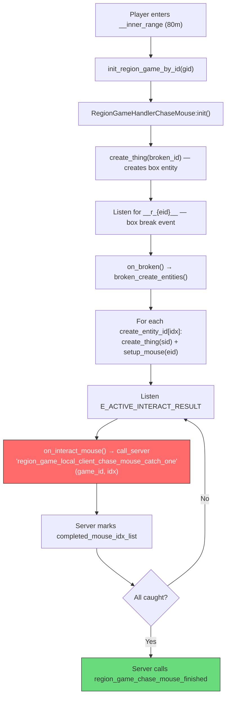

# Type 53 Minigame Solver (Chase Mouse / Break Box)

Extend [yugioh.lua](file:///f:/Coding/Where%20Winds%20Meet/Scripts/actions/yugioh.lua) to auto-solve type 53 ("break box to collect animals/oddities") by directly calling the server RPC for each catch index.

## Research Summary (Score 5/5 — probe-verified ✅)

**Type 53** = `REGION_GAME_CHASE_MOUSE` (const 53 in `region_game_consts.lua:58`)

### Storyline Status (Probe-Verified ✅)

> [!IMPORTANT]
> **Type 53 has NO storyline at all** — no `gameplay_storyline`, no `common_storyline` in type_config. Confirmed at runtime: no chase_mouse storyline in `storyline_handler._storyline_map`.

Type config (runtime dump):
```
type_no = 53
gameplay_name = 6869659022793242308
wanfa_serial_record = [broken_id, create_entity_id]
```

Completion is **purely server-RPC driven** through the common handler system.

### Game Flow (from decompiled source)



**Bypass point** (red): Skip steps D-H, directly call the server RPC for each idx.

### Detection Mechanism (Probe-Verified ✅)

`get_all_running_region_game_id_by_type(53)` works by scanning `_curr_region_game` dict — only contains games where player is **already within `__inner_range`** (typically 80m). This is the same mechanism used by existing GUIHUO (type 8) and FREEZE (type 10) solvers.

**Probe result** (player at `(-846, -736, 213)`, game 2300009 at `(-845, -736, 212)`):
```
Active type 53 games: 1
  game_id=2300009
  broken_id: 1632320017
  create_entity_id count: 1
    [1] = 1632320018
  handler class: instance
```

### Custom Config Schema (Probe-Verified ✅)

```json
{
    "broken_id": 1632320017,       // serial ID of the box to break
    "create_entity_id": [1632320018], // serial IDs of animals to catch (1-N)
    "mouse_speed": 3.0,             // AI movement speed
    "reward_id": 744505             // completion reward
}
```

The `create_entity_id` length determines how many catch RPCs to send.

## Proposed Changes

### Yugioh Module

#### [MODIFY] [yugioh.lua](file:///f:/Coding/Where Winds Meet/Scripts/actions/yugioh.lua)

1. Add constant `REGION_GAME_TYPE_CHASE_MOUSE = 53`
2. In `poll_tick()`, add detection for type 53 games (same pattern as type 8/10)
3. Add `_start_solving_chase_mouse(game_id)`:
   - Get entity count from `G.main_player:get_region_game_custom_config(game_id):get("create_entity_id")`
   - Call `G.net:call_server("region_game_local_client_chase_mouse_catch_one", game_id, idx)` for each 1-based index
   - Short stagger (0.2s) between RPCs to avoid server flooding
   - Mark solving complete after all RPCs sent

## Verification Plan

### Runtime Probe
Run existing probe (now verified working) before and after solving to confirm state changes.

### Manual Verification
1. Stand near game 2300009 (or any type 53 spot)
2. Toggle auto-play ON → confirm log shows type 53 detected and RPCs sent
3. Verify game completes (area clears, reward received)
