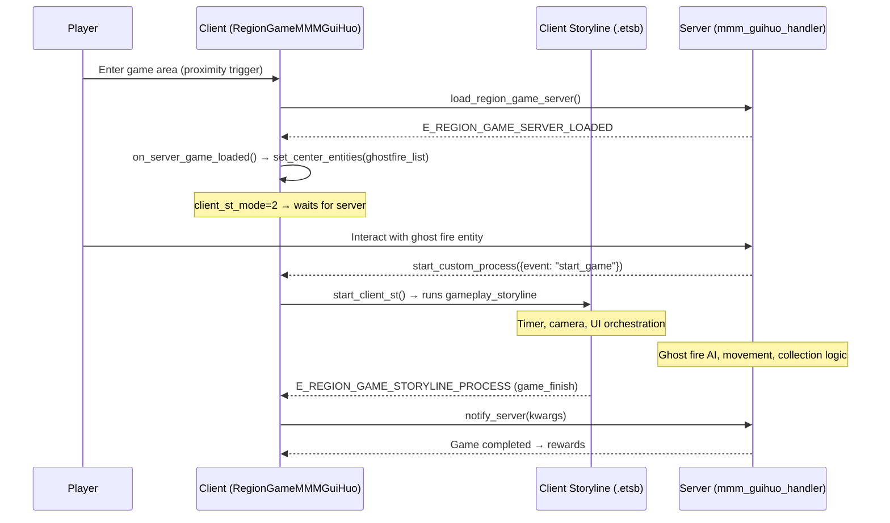

# Game Type 8 — GUIHUO (鬼火 / Ghost Fire) Analysis

## Question / Scope

What is region game type 8? Can we automate solving it via scripting?

---

## Evidence

### 1. Type Identification

**Source:** [region_game_consts.lua](file:///c:/temp/Where%20Winds%20Meet/Scripts/source_decompiled/hexm/common/consts/region_game_consts.lua#L20)

```lua
_M.REGION_GAME_MMM_GUIHUO = 8
```

**Evidence Confidence: 5/5** — Direct definition.

"GUIHUO" (鬼火) = **"Ghost Fire" / "Will-o'-the-Wisp"** — a chase-the-light minigame found in MMM (Miêu Miêu Meo) exploration activities.

---

### 2. Client-Side Class

**Source:** [region_game_server.lua:498-509](file:///c:/temp/Where%20Winds%20Meet/Scripts/source_decompiled/hexm/client/entities/local/player_avatar_members/gameplays/region_game/region_game_server.lua#L498-L509)

```lua
local RegionGameMMMGuiHuo = class("RegionGameMMMGuiHuo", RegionGameServer)
_M.RegionGameMMMGuiHuo = RegionGameMMMGuiHuo
RegionGameMMMGuiHuo.DYNAMIC_CENTER = true

function RegionGameMMMGuiHuo:get_client_st_mode()
  return 2  -- storyline starts on server "start_game" event
end

function RegionGameMMMGuiHuo:on_server_game_loaded()
  RegionGameMMMGuiHuo.on_server_game_loaded.on_server_game_loaded(self)
  self:set_center_entities(self:get_custom_config("t_ghostfire_no_list"))
end
```

**Key Properties:**
| Property | Value | Meaning |
|----------|-------|---------|
| `DYNAMIC_CENTER` | `true` | Game area follows ghost fire entities (not fixed position) |
| `client_st_mode` | `2` | Client storyline starts only when server sends `start_game` event |
| `t_ghostfire_no_list` | serial IDs | List of ghost fire entity serial numbers |

**Evidence Confidence: 5/5** — Direct source definition.

---

### 3. Game Flow Architecture

**Source:** [region_game_server_base.lua:217-228](file:///c:/temp/Where%20Winds%20Meet/Scripts/source_decompiled/hexm/client/entities/local/player_avatar_members/gameplays/region_game/region_game_server_base.lua#L217-L228)



**The flow for `client_st_mode=2`** (line 223-224 of base):
```lua
if data:get("event") == "start_game" and 2 == self:get_client_st_mode() then
    self:start_client_st()
end
```

**Evidence Confidence: 5/5** — Direct source linkage.

---

### 4. Server Handler

**Source:** [region_game_consts.lua:495](file:///c:/temp/Where%20Winds%20Meet/Scripts/source_decompiled/hexm/common/consts/region_game_consts.lua#L495)

```lua
[_M.REGION_GAME_MMM_GUIHUO] = require("hexm.server.space_members.region_game_members.game_handlers.mmm_guihuo_handler").RegionGameMMMGuihuoHandler,
```

The server handler `mmm_guihuo_handler` is **server-only code** — not available in client dumps. This handler controls:
- Ghost fire entity AI (movement patterns)
- Collection/interaction validation
- Success/fail determination
- Reward dispatch

**Evidence Confidence: 4/5** — Handler path confirmed, but source not available for inspection.

---

### 5. Gameplay Description

Based on the code and naming:

| Aspect | Detail |
|--------|--------|
| **Vietnamese Name** | "Hỏa ma" (火魔 = Fire spirit / Ghost fire) |
| **Mechanic** | Chase and interact with moving ghost fire entities |
| **Entity tracking** | `t_ghostfire_no_list` — list of ghost fire entity serial IDs |
| **Dynamic area** | `DYNAMIC_CENTER=true` — game area follows the ghosts |
| **Timer** | Likely timed (storyline-driven countdown via `.etsb`) |
| **Category** | MMM (Miêu Miêu Meo) exploration activity |
| **Belong type** | `BELONG_TYPE_MMM = 1` |

**Also related:** `REGION_GAME_XJC_TIME_COLLECT` (type 37) uses `t_ghostfire_time` and `t_ghostfire_no_list` — indicating a similar "timed collection of ghost fires" pattern exists as a variant.

---

## Conclusions

### What is Game Type 8?

**GUIHUO is a "chase ghost fires" minigame** — the player must follow and interact with will-o'-the-wisp entities that move around the game world within a time limit. It's part of the MMM (Miêu Miêu Meo) exploration system.

### Can We Automate It?

**Feasibility: Moderate — but server-validated.**

#### What the client controls:
1. **Player movement** — moving toward ghost fire positions
2. **Interaction trigger** — interacting with ghost fire entities
3. **Storyline responses** — UI/camera orchestration (just visual, not gameplay)

#### What the server controls:
1. Ghost fire entity AI & movement ← **Server authoritative**
2. Collection validation ← **Server authoritative**
3. Success/fail determination ← **Server authoritative**

#### Automation Approach — Runtime Probe Required

To automate, we'd need to:

1. **Probe at runtime** to discover:
   - The exact ghost fire entity serial IDs (`t_ghostfire_no_list` from custom config)
   - The positions of ghost fire entities in real-time
   - The interaction method (proximity trap? explicit interaction?)

2. **Implement auto-navigation** to each ghost fire:
   ```lua
   -- Pseudocode concept
   local game = G.main_player:get_region_game(game_id)
   local ghost_sids = game:get_custom_config("t_ghostfire_no_list")
   for _, sid in pairs(ghost_sids) do
       local entity = G.space:get_entity_by_serial_no(sid)
       local pos = entity:get_position()
       -- Move player to pos
       -- Trigger interaction
   end
   ```

3. **Handle the interaction** — either:
   - Walk into a trap zone (like scarecrow)
   - Explicitly interact with the entity (like XIWU)

### Recommended Next Steps

1. **Runtime probe** — dump `G.datam.region_game_type_config:get(8)` to see:
   - `gameplay_storyline` path → extract the `.etsb` for full node graph
   - `client_handler` path → confirm the class mapping
   - `common_storyline` → the server-side storyline

2. **Find a live GUIHUO game** — locate a game_id with type=8 near the player and probe:
   - `game:get_custom_config("t_ghostfire_no_list")` → entity serial IDs
   - Ghost fire entity positions and behavior

3. **Extract the storyline** — use MPatch to dump the gameplay `.etsb` file and analyze the node graph (like we did for scarecrow)

4. **Test interaction method** — determine whether the ghost fire uses:
   - Trap-based collection (`E_ENTER_TRAP`)
   - Interact-based collection (`E_ACTIVE_INTERACT_RESULT`)
   - Custom event-based collection

---

## Unknown / Missing Evidence

- Server handler `mmm_guihuo_handler` source code (server-only, not dumped)
- Ghost fire entity AI behavior (movement pattern, speed)
- Exact interaction mechanism (trap vs interact vs custom)
- The `.etsb` storyline for guihuo (path not yet discovered — need probe of `region_game_type_config[8]`)
- Whether ghost fires can be interacted with while moving or require timing
