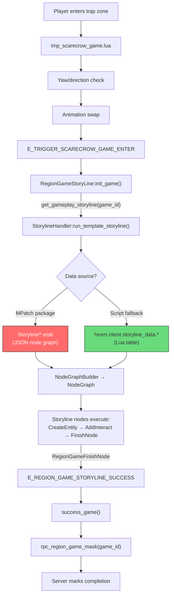

# Scarecrow / Arrow Firing Minigame — Research Report

## Query Normalization

| User Term | Game Term | Confidence |
|-----------|-----------|------------|
| arrow firing | scarecrow | High |
| bow firing minigame | REGION_GAME_SCARECROW (type 104) | High |

## Evidence Summary

### 1. Game Type Constant (Score: 5 — Direct Definition)

**Source:** `region_game_consts.lua:65`

```lua
_M.REGION_GAME_SCARECROW = 104
```

The scarecrow game is a **region game** (type 104), part of the larger region game system that manages ~50+ minigame types.

---

### 2. Scarecrow Game Entry (Score: 5 — Direct Definition)

**Source:** `imp_scarecrow_game.lua`

Three key functions:
- `try_get_scarecrow_region_game_id()` — scans active storylines for one matching `REGION_GAME_SCARECROW` type
- `check_need_change_scarecrow_anim_actio_no()` — validates player is in trap zone + facing correct direction (yaw angle check)
- `_scarecrow_anim_pre_process()` — swaps animation and dispatches `E_TRIGGER_SCARECROW_GAME_ENTER`

The scarecrow game **validates player position** (trap zone) and **direction** (yaw angle) before entering.

---

### 3. Region Game Lifecycle (Score: 5 — Direct Definition)

**Source:** `region_game_base.lua`, `region_game_story_line.lua`, `region_game_server_base.lua`

**Flow:**
```
Player enters trap zone
  → RegionGameStoryLine:init_game()
    → run_template_storyline(st_path, game_id)
      → [storyline scripted gameplay runs]
        → E_REGION_GAME_STORYLINE_SUCCESS dispatched
          → success_game()
            → rpc_region_game_mask(game_id)  [server validates]
```

**Key:** The scarecrow game uses `RegionGameServer` (default handler) with a **storyline** for gameplay. No custom scarecrow handler class exists in `region_game_server.lua`.

---

### 4. Server Validation (Score: 4 — Strong Inference)

**Source:** `region_game_base.lua:254-263`, `region_game_server_base.lua:111-122`

Completion is server-validated via two paths:
1. `success_game()` → `send_success_region_game_id()` → `rpc_region_game_mask(game_id)` (direct)
2. `notify_server(event, data)` → `region_game_process_notify_server()` (process events)

The server handler processes these and marks completion. **No client-only completion possible.**

---

### 5. No Client-Side Scoring (Score: 5 — Confirmed Absence)

Unlike the rhythm game:
- No scoring functions in scarecrow code
- No hit detection or timing logic on client
- No auto-play flag like `G.RHYTHM_GAME_AUTO_PLAY`
- Not a skill/combat system (different from `skill_arrow` files)
- The actual "shooting" mechanic is part of the **undumped storyline** system

---

### 6. E_TRIGGER_SCARECROW_GAME_ENTER Event (Score: 3 — Dispatch Only)

**Source:** `imp_scarecrow_game.lua:81`

```lua
G.gui_dispatcher:dispatch(event_consts.E_TRIGGER_SCARECROW_GAME_ENTER, {})
```

Dispatched when entering game but **no listener found** in decompiled code. Likely handled by undumped UI/storyline controller.

---

## Architecture Diagram



**Red** = stored in MPatch binary package (`.etsb` JSON), not in Lua `package.loaded`  
**Green** = already in `package.loaded`, dumpable by bytecode dumper

> **Resolution:** See [storyline_system.md](file:///c:/temp/Where%20Winds%20Meet/Scripts/docs/storyline_system.md) for full analysis. The storyline data is JSON-serialized visual node graphs (Sunshine engine) stored in `MPatch.GetRawDataInPackage("Storyline/<path>.etsb")`. We can enumerate and extract ALL storyline data using `MPatch.ListDir` + `MPatch.GetRawDataInPackage`.

## Automation Approaches

### Approach A: Direct RPC Completion
**How:** Call `rpc_region_game_mask(game_id)` directly when detecting the scarecrow game state.
- **Pro:** Simple, one RPC call completes the game
- **Con:** Server may require storyline to be running first

### Approach B: Dispatch Storyline Success Event
**How:** Dispatch `E_REGION_GAME_STORYLINE_SUCCESS` with the scarecrow's `game_id`.
- **Pro:** Goes through normal completion flow
- **Con:** Game handler must exist and be initialized

### Approach C: Dump Storyline JSON + Hook Node Execution (Recommended)
**How:** Dump the scarecrow storyline JSON from MPatch, parse the node graph, then hook `RegionAddInteractEventNode` or `RegionGameFinishNode` to auto-complete.
- **Pro:** Generic — works for ANY storyline-driven region game
- **Pro:** Actually understands the game flow
- **Pro:** Enables automation of ALL storyline-driven minigames, not just scarecrow

### Approach D: Hook StorylineHandler to Auto-Finish
**How:** Hook `StorylineHandler:run_template_storyline` to immediately dispatch `E_REGION_GAME_STORYLINE_SUCCESS`.
- **Pro:** Zero knowledge of storyline content needed
- **Con:** May break storyline state machine

> **Recommendation:** Start with the storyline dump probe (Approach C). Understanding the exact node graph lets us build targeted auto-completion that generalizes across all region games.

## Key APIs for Implementation

| API | Purpose |
|-----|---------|
| `G.main_player:try_get_scarecrow_region_game_id()` | Detect active scarecrow game |
| `G.main_player:get_region_game_by_id(game_id)` | Get active game handler |
| `G.main_player:send_success_region_game_id(game_id)` | Complete game via RPC |
| `region_game_consts.REGION_GAME_SCARECROW` | Type constant (104) |
| `MPatch.ListDir("Storyline/")` | Enumerate storyline files in package |
| `MPatch.GetRawDataInPackage("Storyline/<path>")` | Extract storyline JSON data |
| `StorylineSystem.GetRepositoryMgr()` | Access storyline path resolution |

## Next Steps

1. **Run `probe_storyline_dump.lua`** — enumerate Storyline/ directory, read scarecrow storyline JSON, inspect node graph (probe ready at `Scripts/tests/probe_storyline_dump.lua`)
2. **Parse storyline results** — identify the exact node sequence (entities, interactions, finish conditions)
3. **Build generic storyline auto-completer** — hook node execution to automate any storyline-driven game
4. Create `scarecrow_game.lua` action module as first implementation
5. Generalize to other storyline-driven minigames
