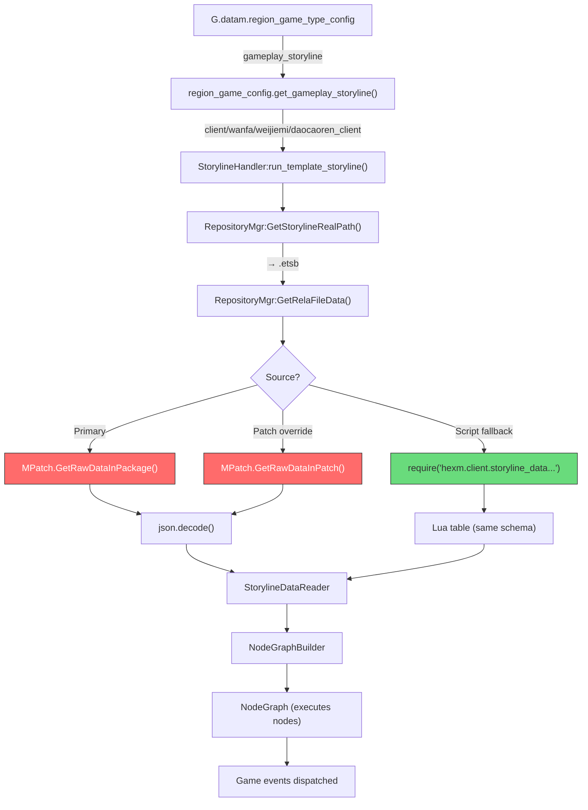
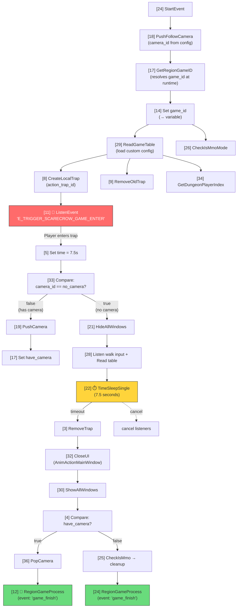

# Storyline System — Comprehensive Reference

## Overview

The game uses a **visual scripting engine called "Sunshine"** for storyline-driven gameplay. Storylines are **JSON node graphs** (`.etsb` files) stored in the game's binary asset package (`MPatch`), NOT Lua code. This is why they don't appear in `package.loaded` and were previously "undumped."

Each storyline is a directed graph of typed nodes (actions, events, conditions) connected by ports. The engine deserializes the JSON, builds a `NodeGraph`, and executes nodes sequentially, branching on conditions and waiting for events.

---

## Architecture



**Red** = stored in MPatch binary package (not in `package.loaded`)
**Green** = Lua table fallback (rare, dumpable)

---

## Data Format (Probe-Verified ✅)

### JSON Schema

Every `.etsb` file contains:

```json
{
  "Variables": {
    "<key>": {
      "name": "game_id",
      "type": "Int",
      "defaultValue": 5700001,
      "Type": "StorylineVariable"
    }
  },
  "Prefabs": {},
  "Entities": {},
  "Storyline": {
    "Version": 2,
    "NodeKeyList": ["<key1>", "<key2>", ...],
    "NodeBuffer": [
      {
        "Type": "StandardListenEventNode",
        "Data": { "event": "E_TRIGGER_SCARECROW_GAME_ENTER" },
        "ConnectData": {
          "__out__": [{ "srcNodeID": 11, "dstNodeID": 5, "srcPortName": "__out__", "dstPortName": "__in__" }]
        },
        "VarData": { "input": { "game_id": ["<variable_key>"] } }
      }
    ],
    "InputParameterNodes": {},
    "OutputParameterNodes": {}
  }
}
```

### Node Schema

Each node in `NodeBuffer` has:

| Field | Description |
|-------|-------------|
| `Type` | Class name that maps to a registered Lua `ActionNode` subclass |
| `Data` | Static configuration for the node (event names, timers, IDs) |
| `VarData` | Variable references — maps port names to variable keys for dynamic input |
| `ConnectData` | Port connections — maps output port names to target `{dstNodeID, dstPortName}` |
| `VariableKey` | (Setter nodes only) Which variable this node writes to |
| `Value` | (Setter nodes only) The value to set |

### Connection Model

Nodes connect via **ports**:
- `__in__` / `__out__` — default trigger flow (execute next)
- Named ports (e.g., `true`, `false`, `success`, `fail`) — conditional branching
- Data ports (e.g., `game_id`, `value`) — pass data between nodes
- `cancel` — cancel/abort a waiting node

---

## File Storage (Probe-Verified ✅)

### Package Layout

```
F:/Tools/Steam/steamapps/common/Where Winds Meet/Package/Storyline/
├── repository.json          (72 Macro entries — reusable sub-graphs)
├── client/
│   ├── dialogs/             (NPC dialog storylines)
│   ├── wanfa/               (gameplay/minigame storylines ← scarecrow is here)
│   │   ├── weijiemi/
│   │   │   └── daocaoren_client.etsb   ← SCARECROW (13,746 bytes)
│   │   ├── zujian/          (component storylines)
│   │   ├── MSD_ST/          (world event storylines)
│   │   └── ...
│   ├── guanqia/             (dungeon/level storylines)
│   ├── task/                (quest storylines)
│   └── interact_process/    (interaction templates)
├── common/
│   └── region_game/
│       └── daocaoren_server (server-side scarecrow storyline)
```

### File Resolution

```lua
-- SunshineSDK/Storyline/StorylineSystem.lua
function RepositoryMgr:GetStorylineRealPath(storyline_path)
  -- "client/wanfa/weijiemi/daocaoren_client"
  -- → "client/wanfa/weijiemi/daocaoren_client.etsb" (production)
end

function RepositoryMgr:GetRelaFileData(relaPath)
  local path = "Storyline/" .. relaPath
  -- 1. Check patch first (hotfix overrides)
  if MPatch.FileExistInPatch(path) then
    return MPatch.GetRawDataInPatch(path)
  end
  -- 2. Fall back to package
  if MPatch.FileExistInPackage(path) then
    return MPatch.GetRawDataInPackage(path)
  end
end
```

### Runtime State (Probe-Verified ✅)

```
RepositoryMgr instance:
  _Workspace:          F:/.../Package/Storyline
  _Patch_Workspace:    F:/.../LocalData/Patch/Storyline
  _Respository:        0 entries (lazy loaded)
  _StPathToScriptPath: 31 entries (Lua script path cache)
  _StNameToRealPath:   16 entries (resolved .etsb path cache)
```

---

## MPatch API (Probe-Verified ✅)

| API | Works? | Notes |
|-----|--------|-------|
| `MPatch.DirExistInPackage("Storyline")` | ✅ `true` | Directory exists |
| `MPatch.DirExistInPackage("Storyline/client")` | ✅ `true` | Subdirectories work |
| `MPatch.FileExistInPackage("Storyline/repository.json")` | ✅ `true` | File check works |
| `MPatch.FileExistInPackage("Storyline/client/wanfa/weijiemi/daocaoren_client.etsb")` | ✅ `true` | Exact path works |
| `MPatch.GetRawDataInPackage("Storyline/client/wanfa/weijiemi/daocaoren_client.etsb")` | ✅ 13,746 bytes | Full JSON extracted |
| `MPatch.ListDir("Storyline")` | ❌ Returns `[]` | Cannot enumerate inside `.mpk` archives |
| `RepositoryMgr:GetRelaFileData(path)` | ✅ Works | Higher-level API, checks patch then package |
| `RepositoryMgr:GetStorylineRealPath(name)` | ✅ Works | Resolves `.ets` → `.etsb` |
| `RepositoryMgr:IsStorylineDataExist(path)` | ✅ Works | Existence check |

> **Key limitation:** `MPatch.ListDir` returns empty lists for package directories. We cannot enumerate all storyline files — we must know the path. Paths come from `G.datam.region_game_type_config[type].gameplay_storyline`.

---

## Node Types (From Decompiled Source + Probe)

### RegionGameNodes.lua — Core Game Nodes

| Node Type | Purpose | Key Data Fields |
|-----------|---------|-----------------|
| `RegionCreateInteractEntityNode` | Create server-side interact target | `serial_no`, `game_id`, `state` |
| `RegionCreateInteractEntityListNode` | Create multiple interact targets | `serial_idx`, `state_idx`, `game_id` |
| `RegionCreateLocalNpcNode` | Create local NPC entity | `serial_no` |
| `RegionAddInteractEventNode` | Listen for player interaction | `list_eid`, `dispatcher_type` |
| `ResetEntityStateNode` | Reset entity to a state | `Eid`, `game_id`, `State` |
| `ResetSeverEntityPositionNode` | Reset entity position | `Eid`, `game_id`, `Pos`, `Yaw` |
| `RegionGameFinishNode` | Dispatch `E_REGION_GAME_STORYLINE_SUCCESS` | `game_id`, `kwargs` |
| `RegionGameProcessNode` | Dispatch `E_REGION_GAME_STORYLINE_PROCESS` | `game_id`, `kwargs`, `event` |
| `CircularRangeCheckNode` | Distance-based area check | `pos`, `radius`, `offset` |
| `CompareInteractomsStateNode` | Compare entity states | `eid_list`, `state_list` |
| `DispatchEventNode` | Dispatch arbitrary event | `event_name`, `dispatcher_type`, `data` |
| `OpenListenToWindNode` | Start "listen to wind" mechanic | `listen_no`, `dialog_no` |

### RegionGameNodesV2.lua — Extended Nodes

| Node Type | Purpose | Key Data Fields |
|-----------|---------|-----------------|
| `StartChallengeNode` | Timer + fail conditions + give-up | `game_id`, `count_down`, `limit_region_id` |
| `DisplayRegionGameUINode` | Progress UI (target count, timer) | `game_id`, `limit_time`, `target_count` |
| `DisplayCountdownUINode` | Countdown timer UI | `count_down` |
| `ActivateCollectEntityNode` | Trap-based collection game | `serial_no_list`, `trap_no`, `max_count` |
| `ActivateCutTreeNode` | Tree cutting game | `tree_type_list`, `refresh_radius` |
| `CheckPutdownNode` | Verify object placement | `target_eid`, `putdown_eid` |
| `VisualIllusionGameNode` | Visual puzzle game | `relation_pairs`, `deviation` |

### Common Storyline Nodes (used in scarecrow)

| Node Type | Purpose |
|-----------|---------|
| `StartEvent` | Entry point of the storyline |
| `TimeSleepNode` | Wait for N seconds |
| `TimeSleepSingleNode` | Cancellable single timer |
| `CompareNode` | Conditional branch (==, !=, <, >) |
| `StorylineVariableSetterNode` | Set a storyline variable |
| `StandardListenEventNode` | Wait for a game event |
| `GetRegionGameIDNode` | Get current game ID from context |
| `RegionGameReadTableNode` | Read `region_game_custom_config` |
| `HideOrShowAllWindowNode` | Toggle UI visibility |
| `CloseUINode` | Close a specific UI window |
| `CreateLocalTrapNode` | Create a local trap zone |
| `RemoveLocalTrapNode` | Remove a local trap zone |
| `GameLevelPushFollowCameraNode` | Push camera to follow target |
| `GameLevelCameraPopCameraNode` | Pop/restore camera |
| `ClientStandardDispatchEventNode` | Dispatch client event |
| `CheckIsMmoModeNode` | Check if in MMO mode |
| `GetValueFromDictByKey` | Extract value from dict |
| `GetListValueByIndexNode` | Extract value from list by index |

---

## Worked Example: Scarecrow Minigame (Probe-Verified ✅)

### Config Lookup

```
G.datam.region_game_type_config[104] = {
    type_no              = 104,
    gameplay_storyline   = "client/wanfa/weijiemi/daocaoren_client",
    common_storyline     = "common/region_game/daocaoren_server",
    gameplay_name        = 4231374561062022263,
    reset_on_trasfer     = 1
}
```

- **Client storyline** (`gameplay_storyline`): Camera, timer, UI orchestration
- **Server storyline** (`common_storyline`): Hit detection, scoring, completion validation

### Storyline Data

**Path:** `Storyline/client/wanfa/weijiemi/daocaoren_client.etsb`
**Size:** 13,746 bytes → 36 nodes, 18 variables

### Variables

| Variable | Type | Default | Purpose |
|----------|------|---------|---------|
| `game_id` | Int | 5700001 | Region game instance ID (overwritten at runtime) |
| `time` | Float | **7.5** | Game timer duration in seconds |
| `anim_id` | Int | 3020 | Bow firing animation ID |
| `have_camera` | Bool | false | Whether special camera is configured |
| `camera_id` | Int | 0 | Camera key for push/pop |
| `interval_min` | Float | 1 | Scarecrow direction change interval (min) |
| `interval_max` | Float | 1 | Scarecrow direction change interval (max) |
| `action_trap_id` | Int | 0 | Serial number for the action trap zone |
| `Anim_UI` | Str | AnimActionMainWindow | Bow-firing UI window |
| `CountDown_UI` | Str | ComCenterCountDownWindow | Countdown UI window |
| `table` | Str | region_game_custom_config | Config table to read at runtime |
| `finish_data` | Any | 0 | Completion data |

### Execution Flow



### Key Insight

> **The client-side scarecrow storyline is a timer + camera + UI orchestrator — NOT the gameplay logic controller.**

The actual hit detection, scoring, and scarecrow direction changes are handled by:
1. `imp_scarecrow_game.lua` — Client-side yaw check and animation
2. `common/region_game/daocaoren_server` — Server-side storyline (validates hits)

The client storyline just:
1. Creates the trap zone and waits for `E_TRIGGER_SCARECROW_GAME_ENTER`
2. Sets up camera and hides UI
3. Runs a **7.5-second timer**
4. After timeout, dispatches `game_finish` via `RegionGameProcessNode`

### Game Instances (Probe-Verified ✅)

11 scarecrow instances in `space=502` (qc_autumn map):

| game_id | Position (x, y, z) | Entities (serial IDs) | Range |
|---------|--------------------|-----------------------|-------|
| 5700005 | (7570, 55, -6836) | [1633210053, 1633210054] | 20/40 |
| 5700006 | (6647, 55, -7712) | [1633210055, 1633210056] | 20/40 |
| 5700007 | (7436, 110, -6582) | [1633210057, 1633210058] | 20/40 |
| 5700009 | (6708, 57, -7371) | [1633210061, 62, 71, 72] | 20/40 |
| 5700010 | (7113, 55, -6973) | [1633210063, 1633210064] | 30/40 |
| +6 more | ... | ... | ... |

---

## Active Storylines at Runtime (Probe-Verified ✅)

At any given time, the player has ~13 active storylines loaded (stages 2-3):

| Path | Stage | Category |
|------|-------|----------|
| `client/dialogs/common_branches_select.etsb` | 3 | Dialog system |
| `client/dialogs/kaifengzhuxian/yincang2504080_shibai.etsb` | 2 | Quest dialog |
| `client/dialogs/yzy/hcwy_water_dive_guide.etsb` | 3 | Tutorial |
| `client/guanqia/beimengyizhi/ansha_xinshou.etsb` | 2 | Dungeon |
| `client/wanfa/guancaifang/qinghejiaohuan.etsb` | 2 | Gameplay |
| `client/wanfa/wulinlu/hcwy_fangshuikou_5.etsb` | 2 | Gameplay |
| `client/wanfa/kaifengzhuxian/task_chapter34_setWanfa.etsb` | 2 | Quest |
| `client/wanfa/MSD_ST/World/BJS_WorldFog_QH.etsb` | 2 | World event |
| `client/task/task_hamagong.etsb` | 2 | Quest |
| +4 more | ... | ... |

**Stage 2** = loaded and active, **Stage 3** = loaded and running

---

## Region Game Types with Storylines (Probe-Verified ✅)

| Type ID | Storyline Path | Handler |
|---------|---------------|---------|
| 101 | `client/wanfa/zujian/why/animal_search_baoxiang` | — |
| 102 | *(none — no client storyline)* | — |
| 103 | *(none)* | — |
| **104** | **`client/wanfa/weijiemi/daocaoren_client`** | **— (scarecrow)** |
| 105 | *(none)* | — |
| 106 | `client/wanfa/miaomiaomiao/xiaolifeidao_client_2` | `RegionGameMMMLimitTimeCollect` |

---

## Dual-Storyline Architecture

Each region game type can have **two storylines**:

| Field | Side | Purpose | Dumped? |
|-------|------|---------|---------|
| `gameplay_storyline` | Client | Camera, UI, timers, local effects | ✅ Can extract via MPatch |
| `common_storyline` | Common | Hit detection, scoring, server validation | ✅ Can extract via MPatch |

For scarecrow:
- **Client:** `client/wanfa/weijiemi/daocaoren_client` — timer orchestrator
- **Server:** `common/region_game/daocaoren_server` — gameplay logic

---

## How to Extract Any Storyline

### By Config Path (preferred)

```lua
-- Get the path from config
local path = G.datam.region_game_type_config:get(type_id, {}):get("gameplay_storyline")
-- e.g. "client/wanfa/weijiemi/daocaoren_client"

-- Resolve to .etsb
local mgr = require("SunshineSDK.Storyline.StorylineSystem").GetRepositoryMgr()
local real_path = mgr:GetStorylineRealPath(path)
-- e.g. "client/wanfa/weijiemi/daocaoren_client.etsb"

-- Read raw data
local raw = mgr:GetRelaFileData(real_path)
-- or directly: MPatch.GetRawDataInPackage("Storyline/" .. real_path)

-- Decode
local json = require("SunshineSDK.compat").json
local data = json.decode(raw)
-- data.Storyline.NodeBuffer = array of nodes
```

### By Watching Active Storylines

```lua
local handler = G.main_player.storyline_handler
for path, storyline in pairs(handler._storyline_map) do
    local file = storyline:GetFilePath()
    -- F:/.../Package/Storyline/client/wanfa/weijiemi/daocaoren_client.etsb
end
```

---

## Source Files Reference

| File | Purpose |
|------|---------|
| `SunshineSDK/Storyline/StorylineSystem.lua` | RepositoryMgr, file resolution, data loading |
| `SunshineSDK/Storyline/Storyline.lua` | Core storyline engine, LoadFromName/LoadFromFile |
| `SunshineSDK/Storyline/StorylineDataReader.lua` | JSON → node graph parser |
| `SunshineSDK/Storyline/Node.lua` | Base ActionNode class |
| `SunshineSDK/Storyline/NodeManager.lua` | Node class registry (RegisterNodeClass) |
| `SunshineSDK/Storyline/NodePort.lua` | Port types (Int, Str, Bool, Float, Any, Trigger) |
| `Sunshine/Storyline/StorylineNode/ClientNode/RegionGameNodes.lua` | Region game node types (V1) |
| `Sunshine/Storyline/StorylineNode/ClientNode/RegionGameNodesV2.lua` | Region game node types (V2) |
| `hexm/common/base/storyline/storyline_handler.lua` | StorylineHandler (manages lifecycle) |
| `hexm/common/base/storyline/storyline_base.lua` | Base storyline class |
| `hexm/client/entities/local/.../region_game_story_line.lua` | Region game ↔ storyline bridge |
| `hexm/client/entities/local/.../region_game_config.lua` | Config helper (get_gameplay_storyline) |

---

## Probe Tests

| Probe | Purpose | Status |
|-------|---------|--------|
| `tests/probe_storyline_dump.lua` | MPatch API test, directory enumeration, RepositoryMgr state | ✅ Passed |
| `tests/probe_storyline_scarecrow.lua` | Extract scarecrow JSON, active storylines, type config | ✅ Passed |

### Extracted Data Files

| File | Content |
|------|---------|
| `logs/scarecrow_storyline.json` | Raw 13,746-byte JSON from MPatch |
| `logs/scarecrow_storyline_pretty.json` | Pretty-printed version (1,127 lines) |
| `logs/scarecrow_analysis.txt` | Node type analysis + connection graph |
| `logs/storyline_repository.json` | Repository macro definitions (72 entries) |
